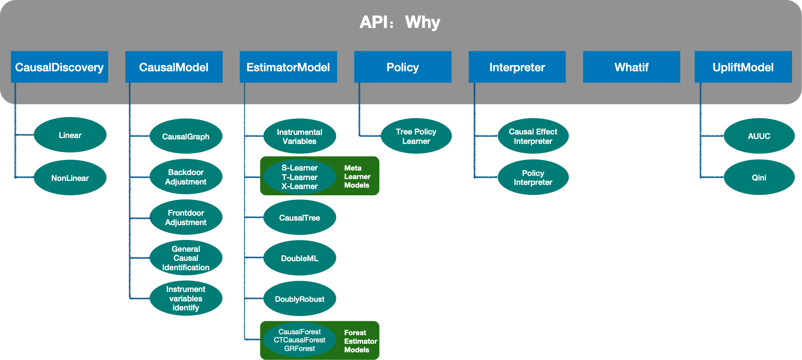
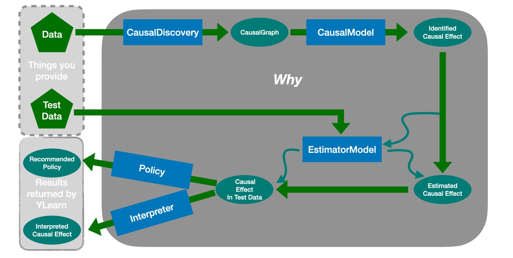

**YLearn**, a pun of "learn why", is a python package for causal inference which supports various aspects of causal inference ranging from causal effect identification, estimation, and causal graph discovery, etc.

Documentation website: <https://ylearn.readthedocs.io/en/latest/index.html>

## Installation

pass

## Overview of YLearn

Machine learning has made great achievements in recent years.
The areas in which machine learning succeeds are mainly for prediction,
e.g., the classificatio of pictures of cats and dogs. However, machine learning is incapable of answering some
questions that naturally arise in many scenarios. One example is for the **counterfactual questions** in policy
evaluations: what would have happened if the policy had changed? Due to the fact that these counterfactuals can
not be observed, machine learning models, the prediction tools, can not be used. These incapabilities of machine
learning partly give rise to applications of causal inference in these days.

Causal inference directly models the outcome of interventions and formalizes the counterfactual reasoning.
With the aid of machine learning, causal inference can draw causal conclusions from observational data in
vairous manners nowdays, rather than relying on conducting craftly designed experiments.

A typical complete causal inference procedure is composed of three parts. First, it learns causal relationships
using the technique called causal discovery. These relationships are then expressed either in the form of Structural
Causal Models or Directed Acyclic Graphs (DAG). Second, it expresses the causal estimand, which are clarified by the
interested causal questions such as the average treatment effects, in terms of the observed data. This process is
known as identification. Finally, once the causal estimand is identified, causal inference proceeds to focus on
estimating the causal estimand from observational data. Then policy evaluation problems and counterfactual questions
can also be answered.

YLearn, equiped with many techniques developed in recent literatures, is implemented to support the whole causal inference pipeline from causal discovery to causal estimand estimation with the help of machine learning. This is more promising especially when there are abundant observational data.

### Concepts in YLearn

There are three main concepts in YLearn corresponding to the causal inference pipeline.

1. *Causal Discovery*. Discovering the causal relationships in the observational data.

2. *Causal Model*. Representing the causal relationships in the form of ``CausalGraph`` and doing other related operations such as identification with ``CausalModel``.

3. *Estimator Model*. Estimating the causal estimand with vairous techniques.

4. *Policy Model*.

5. *Interpreters*.

## Quick Start

pass
aaa
